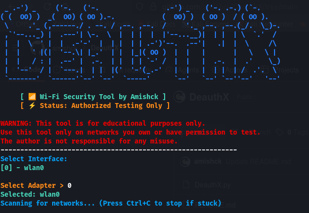

# 📡 DeauthX v1.0
**The Ultimate Wi-Fi Deauthentication & Audit Tool**

Developed by **Amishck**, DeauthX is a streamlined Python-based tool designed for security researchers and authorized penetration testers to audit wireless network stability using deauthentication frames.


---

## 🛠 Features
* **Automated Interface Management**: Switches your wireless card into Monitor Mode automatically.
* **Smart Network Scanning**: Real-time SSID discovery with signal strength indicators.
* **Targeted Deauth**: Disconnect specific clients from a network.
* **Broadcast Attack**: Deauthenticate all clients on a specific Access Point.
* **Safety Auto-Cleanup**: Restores your network stack and restarts NetworkManager upon exit.

---



## 🚀 Installation & Requirements

### Prerequisites
You must be running **Linux** (Kali Linux, Parrot OS, or Arch recommended) and have the **Aircrack-ng** suite installed.

```bash
sudo apt update && sudo apt install aircrack-ng network-manager python3 -y
```

### Setup

  Clone the repository:

```bash
git clone https://github.com/amishck/DeauthX.git
cd DeauthX
```

Give execution permissions:
```Bash
chmod +x deauthx.py
```

## 💻 Usage

Run the tool with root privileges:
Bash

sudo python3 deauthx.py

### Steps:

  1. Select Interface: Choose your wireless adapter (e.g., wlan0).
  2. Scan: Pick your target network from the live-updated list.
  3. Analyze: The tool will scan for active clients on that network.
  4. Attack: Launch a targeted or broadcast deauthentication pulse.

--- 

## ⚠️ Disclaimer

DeauthX is for educational and authorized testing purposes only. Using this tool against networks you do not have explicit permission to test is illegal. The developer assumes no liability for misuse or damage caused by this program.

---

## 📜License

This project is licensed under the [MIT License](LICENSE) - see the LICENSE file for details.
